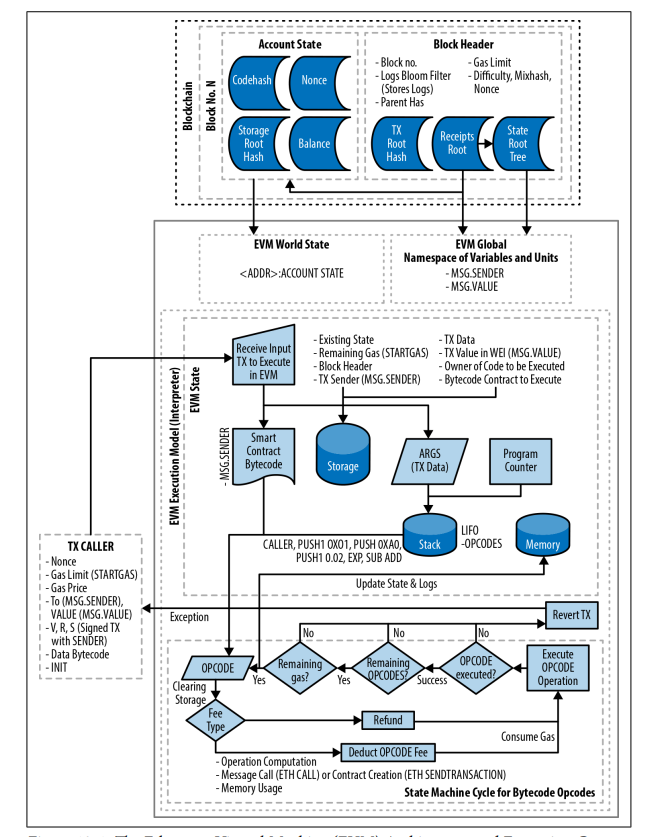
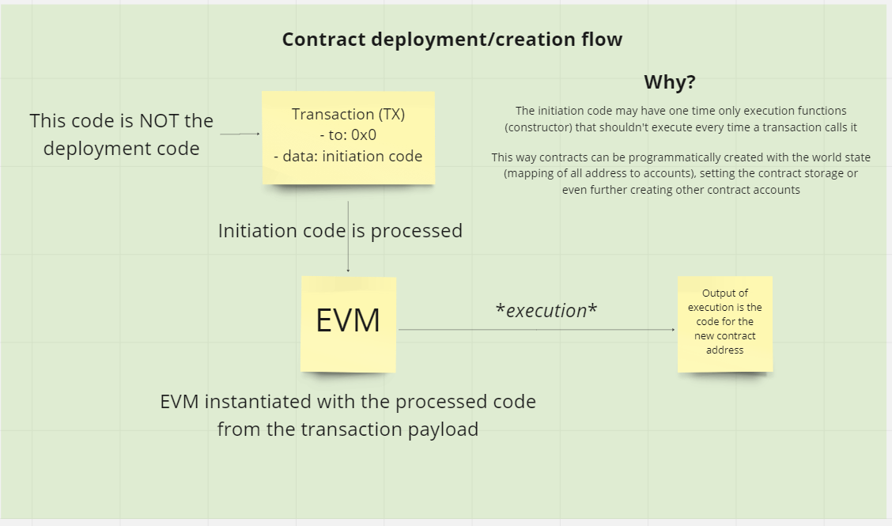

# The Ethereum virtual machine

> The EVM (Ethereum virtual machine) is the part of Ethereum that handles the execution and deployments of smart contracts.

> Simple EOA to EOA transactions (externally owned accounts) don't have to involve the EVM in practice, but everything else that interacts with a smart contract does.

On a high level, the EVM is a global decentralized computer that has millions of executable objects in storage and is shared across a P2P network.

> The EVM is quasi-turing complete, which means that it has solved the "halting" problem by introducing gas fees that stop the execution when too much gas is consumed

- The EVM has immutable code ROM, loaded with the bytecode of a smart contract
- Volatile memory, with every location = 0
- Permanent storage, instantiated with 0

The above flow can be summarized as follows:

> A transaction is received by a smart contract and the EVM is instantiated
>
> The EVM checks for transaction data and loads any bytecode into the stack as OPCODES (different executable operations)
>
> Then, any relevant information needed for the execution of the code is also loaded into storage. Finally, the EVM starts the execution of each OPCODE:
>
> - The execution is first calculated to see if it will exceed the gas allowed. If yes, the transaction and any changes are reverted.
> - Further, the EVM checks for any error or left OPCODES after execution of everything in which case it also reverts the transaction
> - Finally, if everything executed correctly and the program finished, everything is stored in memory and the state is updated.

<h4> Comparison with existing technology

The Ethereum virtual machine can be seen as just a computation engine and storage that has the ability to deploy and run different so called "smart contracts".

The EVM is very similar to JVM or .NET as in that it simulates a computer virtually, enabling compatitability across different platforms and systems.

> The EVM has no scheduling ability, as the nodes (clients) externally decide which smart contracts need execution and execute them in order, one by one. Therefore, we can say that the Ethereum virtual machine is single-threaded - similar to Javascript.

> There is no physical machine interface of the EVM, it is entirely virtual.

<h4> EVM instruction set

• Arithmetic and bitwise logic operations
• Execution context inquiries
• Stack, memory, and storage access
• Control flow operations
• Logging, calling, and other operators

Ontop of this, the ethereum virtual machine has access to account information and block information.

<h4> Ethereum state

> The job of the EVM is to update the global state, triggered by a transaction executing a smart contract.
>
> This can be perceived as updating ownership, storage, etc.

> At the very top level, theres the Ethereum world state. The Ethereum world state represents a mapping of all of the address mapped to the respective account states.

> At the lower level, theres the ether balance, a nonce (the amount of transactions or contract deployments that an EOA has made) and the account's program code.
>
> An EOA has no storage and empty program code

The following flow is important as it highlights what happens when a transactions hits a smart contract:

> The EVM execution can be thought of running a sandboxed version, which in the case of a failure/exception -> reverts and all changes are discarded. The transaction fees are still paid and the transaction is still logged as an attempt.

Since a smart contract can execute transactions itself, this process is recursive (since one smart contract can instantiate its own sandbox EVM, then another, etc.)

<h4> Contract deployment code

There is an important difference between the code used when creating and deploying a smart contract.

> To create a smart contract:

<h4> Turing completeness and gas

> To be turing complete simply means that it can run any program (in theory)

One problem that Turing himself has found is the so called "halting" problem. This is when a program may take forever to run and the only way to find out is by actually running it and waiting to see what happens.

> This, of course, is a huge problem for the Ethereum blockchain, as it is a single-threaded VM and executes contract functionality in order.
>
> If a program were to run forever, the Ethereum blockchain would simply never halt -> resulting in it becoming useless

> To combat this, the execution of smart contracts costs gas. The execution of a contract is halted when it exceeds the so called "block gas limit"

- Block gas limit is not a fixed amont by the Ethereum blockchain, it is adjustable by how much an EOA is willing to pay for the transaction (by setting his gasLimit variable in the transaction)

<h4> Gas

Every OPCODE (operation code) has a fixed gas price in the EVM. The more computationally difficult an OPCODE is, the more gas it costs.

Examples from the Mastering Ethereum book:

> - Adding two numbers costs 3 gas
> - Calculating a Keccak-256 hash costs 30 gas + 6 gas for each 256 bits of data being
>   hashed
> - Sending a transaction costs 21,000 gas

This feature also disincentivizes spam requests, as the attack would have to pay for each request's execution and bandwith in gas.

<h4> Gas accounting during execution

When the EVM is instantiated to execute a transaction's data payload call to a specific function in a contract, it is given a fixed amount of gas limit specified by that transaction.

> Each OPCODE that it executes (addition, storage, etc) costs a specific amount of gas and is deducted in runtime.
>
> If the EVM tracks that it has run out of gas, a OOG exception is thrown and the changes are reverted.

> The EOA that triggered the transaction still pays for the fees, as miners have already started validating at that point.

<h4> Gas cost versus gas price

- Gas limit: max amount of units an EOA is willing to buy
- Gas cost is the amount that an EOA is willing to pay per gas unit

> transaction fee = total gas used * gas price paid (in ether)

    • Gas cost is the number of units of gas required to perform a particular operation.
	• Gas price is the amount of ether you are willing to pay per unit of gas when you
send your transaction to the Ethereum network.

<h6> Negative gas costs (refunds)

Not all actions cost positve gas on the Ethereum blockchain.

In particular, there are two actions that refund gas (cost negative gas):

> Deleting a contract (self destruct) refunds 24,000 gas

> Changing a storage address value from non-zero to zero is 15,000 gas

<h4> Block gas limit

> Lets say we have 5 transactions , each 20,000 gas but the block limit is 80,000. The 4th transaction would have to wait for the next block.
